# 一、概述

**什么是企业级PaaS平台？**

企业级PaaS平台是一套容器管理平台，它可以帮助组织在生产环境中轻松快捷的部署和管理容器。 企业级PaaS平台可以轻松地管理各种环境的Kubernetes，满足IT需求并为DevOps团队提供支持。

Kubernetes不仅已经成为的容器编排标准，它也正在迅速成为各类云和虚拟化厂商提供的标准基础架构。企业级PaaS平台用户可以选择使用RKE创建Kubernetes集群，也可以使用GKE，AKS和EKS等云Kubernetes服务。 企业级PaaS平台用户还可以导入和管理现有的Kubernetes集群。

企业级PaaS平台支持各类集中式身份验证系统来管理Kubernetes集群。例如，大型企业的员工可以使用其公司Active Directory凭证访问GKE中的Kubernetes集群。IT管理员可以在用户，组，项目，集群和云中设置访问控制和安全策略。 IT管理员可以在单个页面对所有Kubernetes集群的健康状况和容量进行监控。

企业级PaaS平台为DevOps工程师提供了一个直观的用户界面来管理他们的服务容器，用户不需要深入了解Kubernetes概念就可以开始使用企业级PaaS平台。 企业级PaaS平台包含应用商店，支持一键式部署Helm模板。企业级PaaS平台通过各种云、本地生态系统产品认证，其中包括安全工具，监控系统，容器仓库以及存储和网络驱动程序。下图说明了企业级PaaS平台在IT和DevOps组织中扮演的角色。每个团队都会在他们选择的公共云或私有云上部署应用程序。

## 1. 架构设计

本章节主要说明企业级PaaS平台如何与建立在其上的Docker和Kubernetes技术栈进行交互的。

### Docker

Docker是容器包装和运行时标准。 开发人员从Dockerfiles构建容器镜像，并从Docker镜像仓库分发容器镜像。 Docker Hub是最受欢迎的公共注册表。 许多组织还设置了私有Docker镜像仓库。 Docker主要用于管理单个节点上的容器。

### Kubernetes

Kubernetes是容器集群管理标准。 YAML文件指定了构成应用程序的容器和其他资源。 Kubernetes执行诸如调度，扩展，服务发现，运行状况检查，密文管理和配置管理之类的功能。

一个Kubernetes集群由多个节点组成。

- **etcd数据库**
  尽管您只能在一个节点上运行etcd，但通常需要3、5个或更多节点来创建HA配置。
- **主节点-Master nodes**
  主节点是无状态的，用于运行API服务器，调度程序和控制器。
- **工作节点-Worker nodes**
  应用程序工作负载在工作程序节点上运行。

### 企业级PaaS平台

​        大多数PaaS平台的软件都在PaaS服务器上运行。 PaaS服务器包含用于管理整个PaaS平台部署的所有软件组件。

​        下图说明了PaaS平台的高级体系结构。 该图描绘了管理两个Kubernetes群集的PaaS平台部署：一个由Rancher Kubernetes Engine（RKE）创建，另一个由Amazon EKS（Elastic Kubernetes Service）创建。


下面我们将介绍每个企业级PaaS平台的组件和功能。

#### API服务器

API服务器建立在嵌入式Kubernetes API服务器和etcd数据库之上。 它实现以下功能：

- **用户管理**
  API服务器管理与外部身份验证系统例如Active Directory、OpenLDAP或GitHub相对应的用户身份。
- **授权**
  API服务器管理访问控制和安全策略。
- **项目**
  项目是集群中的一组多个名称空间和访问控制策略的集合。
- **节点**
  API服务器跟踪所有集群中所有节点的身份。

#### 集群控制器和代理

集群控制器和集群代理实现了管理Kubernetes集群所需的业务逻辑。

- 群集控制器实现全局安装所需的逻辑。 它执行以下操作：
  - 配置对集群和项目的访问控制策略。
  - 通过调用以下命令来配置集群：
    - 所需的Docker machine驱动程序。
    - 像RKE和GKE这样的Kubernetes引擎。
- 一个单独的群集代理实例实现了相应群集所需的逻辑。 它执行以下操作：
  - 工作负载管理，例如在每个集群中的Pod创建和部署。
  - 绑定并应用每个集群全局策略中定义的角色。
  - 群集与PaaS平台服务器之间的通信：事件，统计信息，节点信息和运行状况。

#### 认证代理

身份验证代理转发所有Kubernetes API调用。 它与本地身份验证如Active Directory、OpenLDAP和GitHub等身份验证服务集成。 在每个Kubernetes API调用上，身份验证代理都会对调用方进行身份验证并设置正确的Kubernetes模拟头，然后再将调用转发给Kubernetes主节点。 PaaS平台服务器使用服务帐户与Kubernetes集群进行通信。

## 2. UI及相关术语

### 全局层

全局层主要对PaaS平台自身的基础配置,比如PaaS平台的URL、登录认证等。

- **集群**
  全局层的集群菜单，用于列出集群中所有的K8S集群。
  
- **多集群应用**
  用于部署跨多集群部署的无状态应用。
- **用户**
  添加或者删除用户，或者修改用户的权限。
  
- **系统设置**
  全局下系统的基础配置，比如系统默认镜像仓库。
  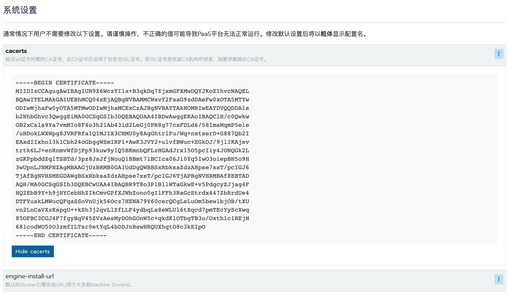
- **安全**
  - 角色
    用来管理全局、集群、项目三个层面的角色，用户可以根据需要创建属于自己的角色。
        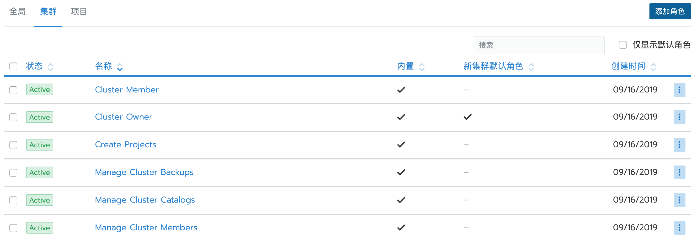
  - Pod安全策略
    设置Pods的间的安全策略，例如是否允许Pod提升权限、是否可以访问主机网络、SELinux策略等
  - 认证
    选择用户登录认证的方式，并提供了与常用认证系统的集成。
    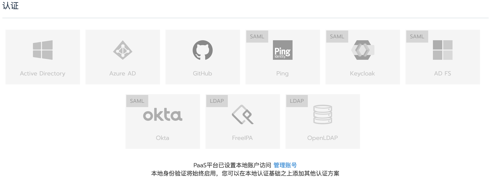
- **工具**
  - 应用商店设置
    您可以设置并自定义全局应用商店。
    
  - 驱动管理
    针对公有云Kubernetes集群的驱动管理，通过该驱动可以在公有云或私有云中自动创建集群。
    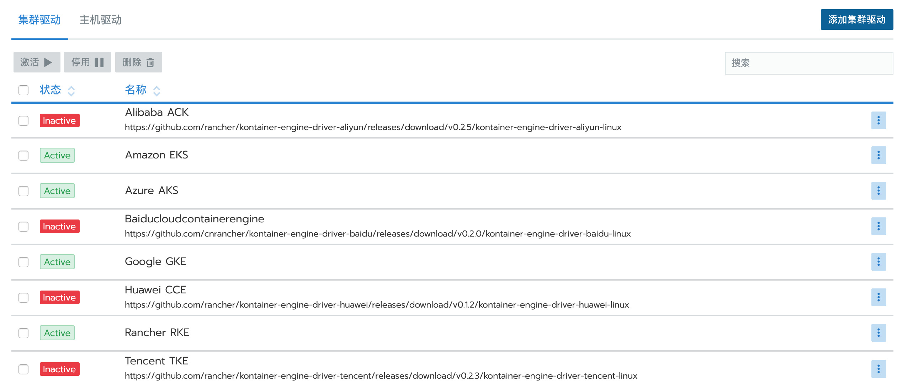

### 集群层

- 集群
  显示当前集群的资源配置情况，各系统组件的健康状态；2.2之前，集群仪表盘显示当前集群的资源预留状态(并非实际资源使用)；
  
- 主机
  当前集群中添加的所有主机
  
- 存储
  - 存储类
    显示可用连接的存储资源类
  - 持久卷
    通过存储类或者CSI接口定义好的存储空间
- 项目与命名空间
  此集群拥有的项目和命名空间
  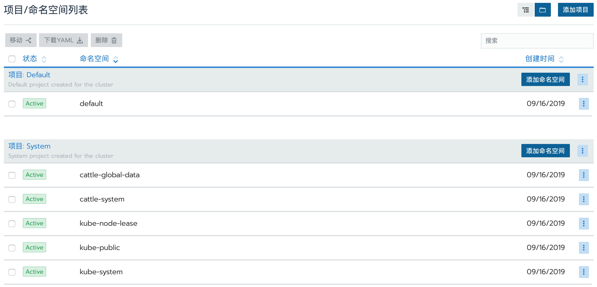
- 集群成员
  维护和管理可以访问集群的成员用户
  
- 工具
  - 告警
    设置集群级别的告警规则
    
  
  - 应用商店设置
    您可以设置并自定义集群级别的应用商店。
  
  - 通知
    设置集群告警的目标端
    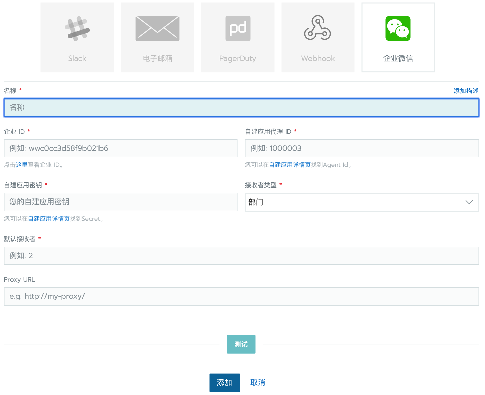
  
  - 日志
    设置系统日志、应用日志的接收参数
  
    

### 项目层

- 工作负载
  - 工作负载服务
    管理和部署容器服务
  
    
  
    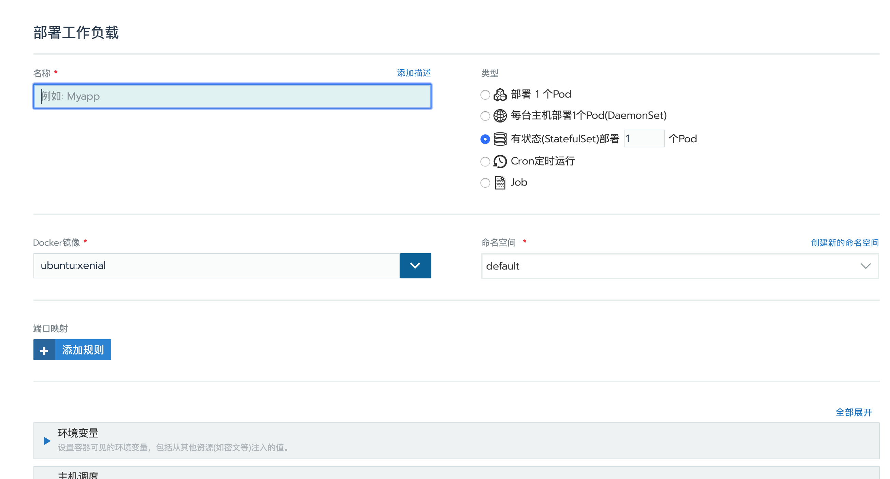
  
  - 负载均衡
    用来设置Ingress负载均衡
    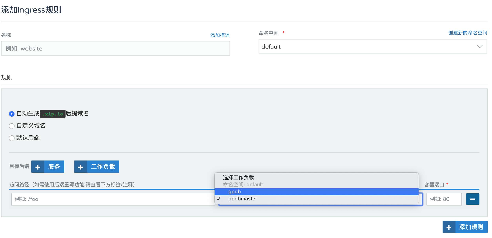
  
  - 服务发现
    管理和修改应用服务名称和内部解析
    
  
  - PVC数据卷
    管理POD挂载使用持久卷
    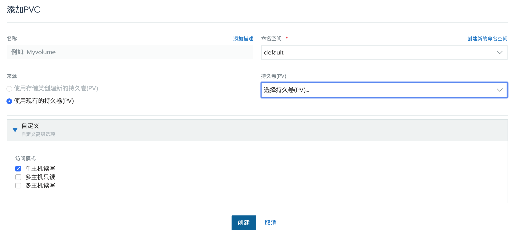
  
  - 流水线
    用来配置持续集成、持续部署流水线
  
- 应用商店
  从应用商店选择并快速部署应用

  
- 资源
  - 证书
    存储和管理CA证书
  
  - 配置映射
    管理项目下的configmap配置
    
  
  - 镜像库
    用来存储镜像仓库登录信息和密码
  
    
  
  - 密文
    集中存储加密文本、密码
    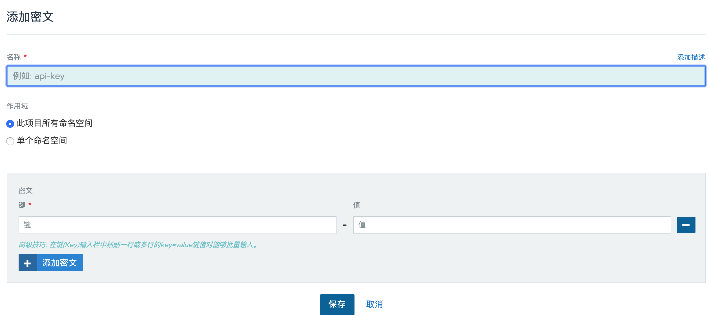
  
- 命名空间
  用来定义和管理命名空间
  

- 项目成员
  维护和管理可以访问项目的成员用户

### 其他 (右上角登录菜单)


- API Keys
  API密钥与特定用户(例如: Default Admin)绑定，可以创建、删除和操作有权访问的所有集群和项目。
  

- 公凭证&主机模板
  提供对公有云的管理，可存储公有云凭证和云主机配置模板
  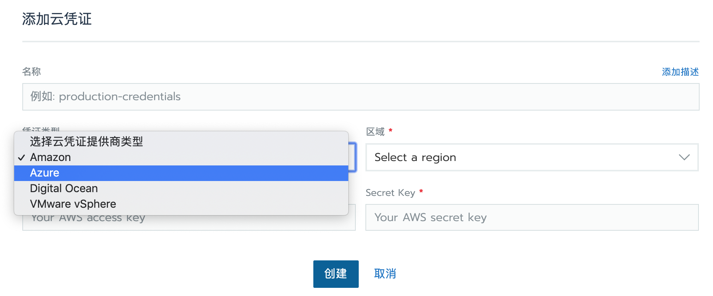
  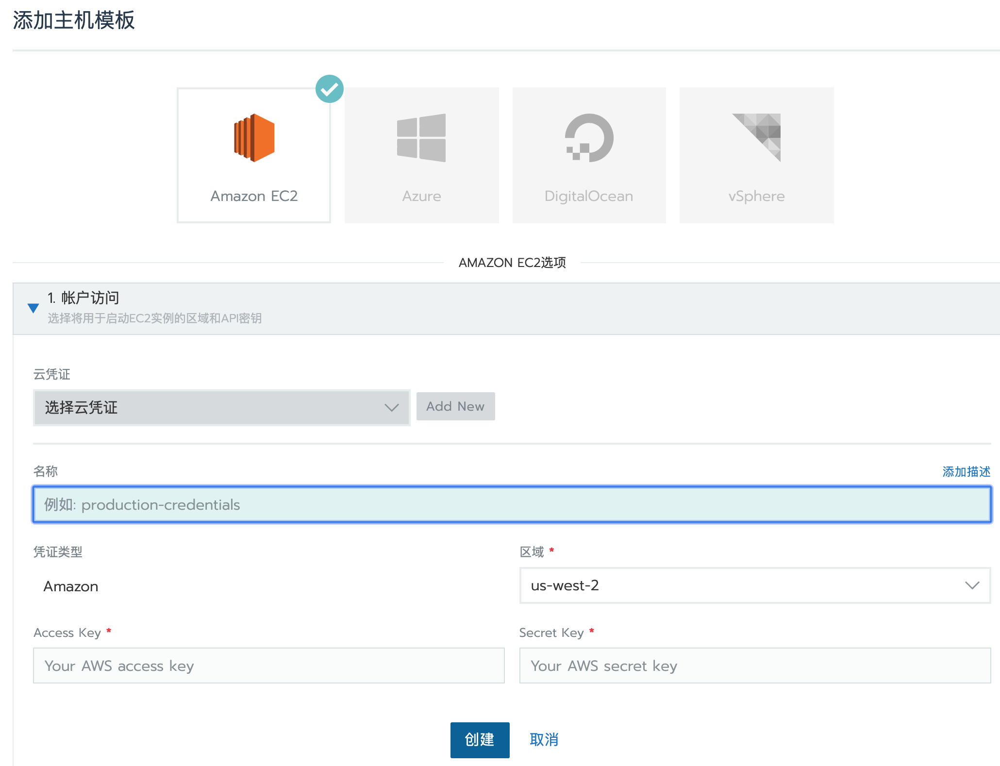
- 设定
  设置UI主题偏好

  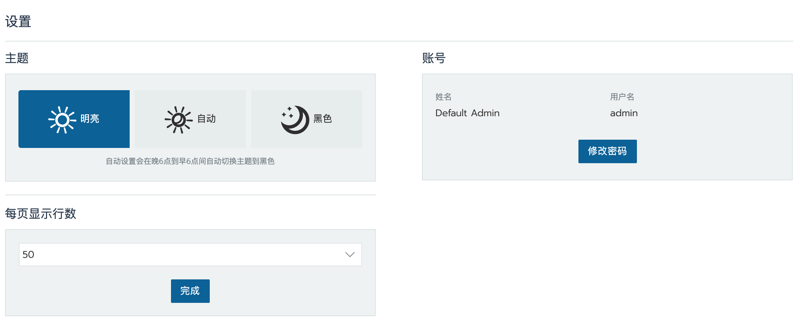

# 二、安装

## 1. 安装要求

### 1.1 操作系统和Docker要求

| OPERATING SYSTEM                                        | TESTED DOCKER VERSIONS                    |
| :------------------------------------------------------ | :---------------------------------------- |
| Ubuntu 16.04 (64-bit x86)                               | Docker 17.03.x, 18.06.x, 18.09.x, 19.03.x |
| Ubuntu 18.04 (64-bit x86)                               | Docker 18.06.x, 18.09.x, 19.03.x          |
| Red Hat Enterprise Linux (RHEL)/CentOS 7.7 (64-bit x86) | RHEL Docker 1.13                          |
| Oracle Linux 7 update 6 (64-bit x86)                    | Docker 17.03.x, 18.06.x, 18.09.x, 19.03.x |
| RancherOS 1.5.4 (64-bit x86)                            | Docker 17.03.x, 18.06.x, 18.09.x, 19.03.x |

### 1.2 硬件要求

#### 1.2.1 CPU和内存

硬件要求，根据您的部署规模而定。 具体取决于您高可用性（HA）群集的部署规模。

| DEPLOYMENT SIZE | CLUSTERS  | NODES      | VCPUS    | RAM      |
| :-------------- | :-------- | :--------- | :------- | :------- |
| Small           | Up to 5   | Up to 50   | 2        | 8 GB     |
| Medium          | Up to 15  | Up to 200  | 4        | 16 GB    |
| Large           | Up to 50  | Up to 500  | 8        | 32 GB    |
| X-Large         | Up to 100 | Up to 1000 | 32       | 128 GB   |
| XX-Large        | 100+      | 1000+      | 联系我们 | 联系我们 |

#### 1.2.2 磁盘

PaaS平台的性能取决于集群组件etcd的性能。 为了确保最佳速度，我们建议始终使用SSD磁盘来部署PaaS平台的管理集群。 在公有云提供商上，您还需要使用允许最大IOPS的最小大小。 在较大的集群中，请考虑将专用存储设备用于etcd数据和wal目录。

#### 1.2.3 网络要求

- 节点IP地址
  每个使用PaaS平台的节点都应配置一个静态IP。 如果使用DHCP，则每个节点都应具有DHCP保留功能，以确保该节点每次分配到相同的IP。

- 端口要求
  在HA集群中部署PaaS平台时，必须打开节点上的某些端口以允许与PaaS平台通信。必须打开的端口根据托管集群节点的计算机类型而变化，例如，如果要在基础结构托管的节点上部署PaaS平台，则必须为SSH打开22端口。表描绘了需要为每种集群类型打开的端口。

  | Type            | Protocol | Port Range  | Rule Type |
  | :-------------- | :------- | :---------- | :-------- |
  | SSH             | TCP      | 22          | Inbound   |
  | HTTP            | TCP      | 80          | Inbound   |
  | Custom TCP Rule | TCP      | 443         | Inbound   |
  | Custom TCP Rule | TCP      | 2376        | Inbound   |
  | Custom TCP Rule | TCP      | 2379-2380   | Inbound   |
  | Custom UDP Rule | UDP      | 4789        | Inbound   |
  | Custom TCP Rule | TCP      | 6443        | Inbound   |
  | Custom UDP Rule | UDP      | 8472        | Inbound   |
  | Custom TCP Rule | TCP      | 10250-10252 | Inbound   |
  | Custom TCP Rule | TCP      | 10256       | Inbound   |
  | Custom TCP Rule | TCP      | 30000-32767 | Inbound   |
  | Custom UDP Rule | UDP      | 30000-32767 | Inbound   |
  | All traffic     | All      | All         | Outbound  |

## 2. 安装Kubernetes集群

使用RKE安装具有高可用性etcd配置的Kubernetes。

- 创建`cluster.yml`文件
  使用下面的示例创建`cluster.yml`文件，使用创建的3个节点的IP地址或域名替换列表中的IP地址。

  ```yaml
  nodes:
    - address: 200.200.200.11
      user: ubuntu
      role: [controlplane,worker,etcd]
    - address: 200.200.200.12
      user: ubuntu
      role: [controlplane,worker,etcd]
    - address: 200.200.200.13
      user: ubuntu
      role: [controlplane,worker,etcd]
  
  # 如果要使用私有仓库中的镜像，配置以下参数来指定默认私有仓库地址。
  ##private_registries:
  ##    - url: registry.com
  ##      user: Username
  ##      password: password
  ##      is_default: true
  
  services:
    etcd:
      # 扩展参数
        extra_args:
          auto-compaction-retention: 240 #(单位小时)
          # 修改空间配额为$((6*1024*1024*1024))，默认2G,最大8G
          quota-backend-bytes: '6442450944'
      # rke 0.2之后版本
      backup_config:
        enabled: true     # enables recurring etcd snapshots
        interval_hours: 6 # time increment between snapshots
        retention: 60     # time in days before snapshot purge
  ```

  > 配置文件常用选项
  >
  > | Option             | Required | Description                                                  |
  > | :----------------- | :------- | :----------------------------------------------------------- |
  > | `address`          | yes      | 公共域名或IP地址                                             |
  > | `user`             | yes      | 可以运行docker命令的用户                                     |
  > | `role`             | yes      | 分配给节点的Kubernetes角色列表                               |
  > | `internal_address` | no       | 内部集群通信的私有域名或IP地址                               |
  > | `ssh_key_path`     | no       | 用于对节点进行身份验证的SSH私钥的路径（默认为~/.ssh/id_rsa） |

- 创建Kubernetes集群

  ```sh
  rke up --config cluster.yml
  ```

  安装完成后将出现如下： `Finished building Kubernetes cluster successfully`.

- 验证集群状态
  集群创建成功后会创建`kube_config_cluster.yml`文件。这个文件包含kubectl和helm访问K8S的凭据。您可以将此文件复制到`$HOME/.kube/config`，或者如果您正在使用多个Kubernetes集群，请将`KUBECONFIG`环境变量设置为`kube_config_cluster.yml`文件路径。

  ```sh
  export KUBECONFIG=$(pwd)/kube_config_cluster.yml
  ```

  通过`kubectl`测试您的连接，并查看您的所有节点是否处于`Ready`状态。

  ```sh
  kubectl --kubeconfig=kube_config_cluster.yml  get  nodes
  
  NAME                          STATUS    ROLES                      AGE       VERSION
  200.200.200.11               Ready     controlplane,etcd,worker   11m       v1.14.6
  200.200.200.12               Ready     controlplane,etcd,worker   11m       v1.14.6
  200.200.200.13               Ready     controlplane,etcd,worker   11m       v1.14.6
  ```

- 妥善保管好配置文件
  保存`kube_config_cluster.yml`和`cluster.yml`文件的副本,您将需要这些文件来维护和升级Kubernetes实例。

## 3. 安装配置Helm

Helm是Kubernetes选择的包管理工具。Helm “charts” 为Kubernetes YAML文档提供了模板语法。有了Helm，我们可以创建可配置的部署，而不只是使用静态文件。有关创建您自己的部署目录的更多信息，请查看https://helm.sh/中的文档。为了能够使用Helm，需要在集群上安装服务器端组件`Tiller`。

> 注意**
>
> helm使用需要kubectl，请提前安装好kubectl

安装步骤如下：

- 创建 `ServiceAccount` 在 `kube-system` 命名空间
- 创建 `ClusterRoleBinding` 使 `tiller`可以访问集群
- 最后使用`helm`安装`tiller`服务

```sh
kubeconfig=kube_config_cluster.yml

helm_version=`helm version |grep Client | awk -F""\" '{print $2}'`
 kubectl --kubeconfig=$kubeconfig --namespace=kube-system \
 set image deployments/tiller-deploy \
 tiller=registry.cn-shanghai.aliyuncs.com/rancher/tiller:$helm_version
```

查看安装结果：

```
kubectl -n kube-system  rollout status deploy/tiller-deploy
Waiting for deployment "tiller-deploy" rollout to finish: 0 of 1 updated replicas are available...
deployment "tiller-deploy" successfully rolled out

helm version
Client: &version.Version{SemVer:"v2.12.1", GitCommit:"02a47c7249b1fc6d8fd3b94e6b4babf9d818144e", GitTreeState:"clean"}
Server: &version.Version{SemVer:"v2.12.1", GitCommit:"02a47c7249b1fc6d8fd3b94e6b4babf9d818144e", GitTreeState:"clean"}
```

## 4. 安装PaaS平台

#### 4.1 证书配置
- 配置DNS域名服务，后续平台访问都将使用域名形式（或修改客户机Host文件，window路径：C:\Windows\System32\drivers\etc\hosts，linux路径：/etc/hosts）。

> 200.200.200.11 paas.com
 
-  HTTP over SSL
要保证Web浏览器到服务器的安全连接，HTTPS几乎是唯一选择。HTTPS其实就是HTTP over SSL，也就是让HTTP连接建立在SSL安全连接之上。
在HTTPS的传输过程中，需要使用数字证书。使用ssl自签名证书脚本：
```shell
#!/bin/bash -e

help ()
{
    echo  ' ================================================================ '
    echo  ' --ssl-domain: 生成ssl证书需要的主域名，如不指定则默认为www.rancher.local，如果是ip访问服务，则可忽略；'
    echo  ' --ssl-trusted-ip: 一般ssl证书只信任域名的访问请求，有时候需要使用ip去访问server，那么需要给ssl证书添加扩展IP，多个IP用逗号隔开；'
    echo  ' --ssl-trusted-domain: 如果想多个域名访问，则添加扩展域名（SSL_TRUSTED_DOMAIN）,多个扩展域名用逗号隔开；'
    echo  ' --ssl-size: ssl加密位数，默认2048；'
    echo  ' --ssl-date: ssl有效期，默认10年；'
    echo  ' --ca-date: ca有效期，默认10年；'
    echo  ' --ssl-cn: 国家代码(2个字母的代号),默认CN;'
    echo  ' 使用示例:'
    echo  ' ./create_self-signed-cert.sh --ssl-domain=www.test.com --ssl-trusted-domain=www.test2.com \ '
    echo  ' --ssl-trusted-ip=1.1.1.1,2.2.2.2,3.3.3.3 --ssl-size=2048 --ssl-date=3650'
    echo  ' ================================================================'
}

case "$1" in
    -h|--help) help; exit;;
esac

if [[ $1 == '' ]];then
    help;
    exit;
fi

CMDOPTS="$*"
for OPTS in $CMDOPTS;
do
    key=$(echo ${OPTS} | awk -F"=" '{print $1}' )
    value=$(echo ${OPTS} | awk -F"=" '{print $2}' )
    case "$key" in
        --ssl-domain) SSL_DOMAIN=$value ;;
        --ssl-trusted-ip) SSL_TRUSTED_IP=$value ;;
        --ssl-trusted-domain) SSL_TRUSTED_DOMAIN=$value ;;
        --ssl-size) SSL_SIZE=$value ;;
        --ssl-date) SSL_DATE=$value ;;
        --ca-date) CA_DATE=$value ;;
        --ssl-cn) CN=$value ;;
    esac
done

# CA相关配置
CA_DATE=${CA_DATE:-3650}
CA_KEY=${CA_KEY:-cakey.pem}
CA_CERT=${CA_CERT:-cacerts.pem}
CA_DOMAIN=cattle-ca

# ssl相关配置
SSL_CONFIG=${SSL_CONFIG:-$PWD/openssl.cnf}
SSL_DOMAIN=${SSL_DOMAIN:-'www.rancher.local'}
SSL_DATE=${SSL_DATE:-3650}
SSL_SIZE=${SSL_SIZE:-2048}

## 国家代码(2个字母的代号),默认CN;
CN=${CN:-CN}

SSL_KEY=$SSL_DOMAIN.key
SSL_CSR=$SSL_DOMAIN.csr
SSL_CERT=$SSL_DOMAIN.crt

echo -e "\033[32m ---------------------------- \033[0m"
echo -e "\033[32m       | 生成 SSL Cert |       \033[0m"
echo -e "\033[32m ---------------------------- \033[0m"

if [[ -e ./${CA_KEY} ]]; then
    echo -e "\033[32m ====> 1. 发现已存在CA私钥，备份"${CA_KEY}"为"${CA_KEY}"-bak，然后重新创建 \033[0m"
    mv ${CA_KEY} "${CA_KEY}"-bak
    openssl genrsa -out ${CA_KEY} ${SSL_SIZE}
else
    echo -e "\033[32m ====> 1. 生成新的CA私钥 ${CA_KEY} \033[0m"
    openssl genrsa -out ${CA_KEY} ${SSL_SIZE}
fi

if [[ -e ./${CA_CERT} ]]; then
    echo -e "\033[32m ====> 2. 发现已存在CA证书，先备份"${CA_CERT}"为"${CA_CERT}"-bak，然后重新创建 \033[0m"
    mv ${CA_CERT} "${CA_CERT}"-bak
    openssl req -x509 -sha256 -new -nodes -key ${CA_KEY} -days ${CA_DATE} -out ${CA_CERT} -subj "/C=${CN}/CN=${CA_DOMAIN}"
else
    echo -e "\033[32m ====> 2. 生成新的CA证书 ${CA_CERT} \033[0m"
    openssl req -x509 -sha256 -new -nodes -key ${CA_KEY} -days ${CA_DATE} -out ${CA_CERT} -subj "/C=${CN}/CN=${CA_DOMAIN}"
fi

echo -e "\033[32m ====> 3. 生成Openssl配置文件 ${SSL_CONFIG} \033[0m"
cat > ${SSL_CONFIG} <<EOM
[req]
req_extensions = v3_req
distinguished_name = req_distinguished_name
[req_distinguished_name]
[ v3_req ]
basicConstraints = CA:FALSE
keyUsage = nonRepudiation, digitalSignature, keyEncipherment
extendedKeyUsage = clientAuth, serverAuth
EOM

if [[ -n ${SSL_TRUSTED_IP} || -n ${SSL_TRUSTED_DOMAIN} ]]; then
    cat >> ${SSL_CONFIG} <<EOM
subjectAltName = @alt_names
[alt_names]
EOM
    IFS=","
    dns=(${SSL_TRUSTED_DOMAIN})
    dns+=(${SSL_DOMAIN})
    for i in "${!dns[@]}"; do
      echo DNS.$((i+1)) = ${dns[$i]} >> ${SSL_CONFIG}
    done

    if [[ -n ${SSL_TRUSTED_IP} ]]; then
        ip=(${SSL_TRUSTED_IP})
        for i in "${!ip[@]}"; do
          echo IP.$((i+1)) = ${ip[$i]} >> ${SSL_CONFIG}
        done
    fi
fi

echo -e "\033[32m ====> 4. 生成服务SSL KEY ${SSL_KEY} \033[0m"
openssl genrsa -out ${SSL_KEY} ${SSL_SIZE}

echo -e "\033[32m ====> 5. 生成服务SSL CSR ${SSL_CSR} \033[0m"
openssl req -sha256 -new -key ${SSL_KEY} -out ${SSL_CSR} -subj "/C=${CN}/CN=${SSL_DOMAIN}" -config ${SSL_CONFIG}

echo -e "\033[32m ====> 6. 生成服务SSL CERT ${SSL_CERT} \033[0m"
openssl x509 -sha256 -req -in ${SSL_CSR} -CA ${CA_CERT} \
    -CAkey ${CA_KEY} -CAcreateserial -out ${SSL_CERT} \
    -days ${SSL_DATE} -extensions v3_req \
    -extfile ${SSL_CONFIG}

echo -e "\033[32m ====> 7. 证书制作完成 \033[0m"
echo
echo -e "\033[32m ====> 8. 以YAML格式输出结果 \033[0m"
echo "----------------------------------------------------------"
echo "ca_key: |"
cat $CA_KEY | sed 's/^/  /'
echo
echo "ca_cert: |"
cat $CA_CERT | sed 's/^/  /'
echo
echo "ssl_key: |"
cat $SSL_KEY | sed 's/^/  /'
echo
echo "ssl_csr: |"
cat $SSL_CSR | sed 's/^/  /'
echo
echo "ssl_cert: |"
cat $SSL_CERT | sed 's/^/  /'
echo

echo -e "\033[32m ====> 9. 附加CA证书到Cert文件 \033[0m"
cat ${CA_CERT} >> ${SSL_CERT}
echo "ssl_cert: |"
cat $SSL_CERT | sed 's/^/  /'
echo

echo -e "\033[32m ====> 10. 重命名服务证书 \033[0m"
echo "cp ${SSL_DOMAIN}.key tls.key"
cp ${SSL_DOMAIN}.key tls.key
echo "cp ${SSL_DOMAIN}.crt tls.crt"
cp ${SSL_DOMAIN}.crt tls.crt
```
复制以上代码另存为create_self-signed-cert.sh或者其他您喜欢的文件名。
使用示例:
```shell
chmod +x create_self-signed-cert.sh
./create_self-signed-cert.sh --ssl-domain=paas.com --ssl-trusted-ip=200.200.200.11,200.200.200.12,200.200.200.13 --ssl-size=2048 --ssl-date=3650 --ssl-cn=CN
```


#### 4.2 平台部署
- 添加仓库
使用helm repo add命令添加Rancher chart仓库
```shell
helm repo add rancher-stable https://releases.rancher.com/server-charts/stable
```

- 创建tls密文
进入创建create_self-signed-cert.sh目录，创建tls密文，用于平台验证
```shell
kubectl  -n cattle-system \
  create secret tls tls-rancher-ingress --cert=./tls.crt --key=./tls.key
```

- 配置SSL
创建其对应的命名空间，配置ca证书密文
```shell

# 创建命名空间
kubectl create namespace cattle-system

# ca证书密文
kubectl -n cattle-system create secret \
generic tls-ca \
--from-file=cacerts.pem
```shell
- 安装Paas
执行如下脚本，对paas平台进行安装
```shell
helm install rancher-stable/rancher \
    --name paas --namespace cattle-system \
    --set hostname=paas.com \
    --set privateCA=true
```
验证helm list命令中，
```shell
kubectl -n cattle-system rollout status deploy/paas
deployment "rancher" successfully rolled out
```

# 三、使用

按场景提供使用步骤，

# 四、维护

## 升级回滚

#### Helm HA
###### 一、先决条件
> 如果在升级期间出现问题，可使用数据备份进行恢复
> 安装配置kubectl，升级将使用kubectl操作。
> 如果之前是通过RKE部署的，那首先需要安装Helm Server和Helm 客户端，安装方法参考安装Helm Server和Helm 客户端安装最新版本Helm Server和Helm 客户端

###### 二、升级文件准备
更新本地helm repo缓存；
```shell
helm repo update
```
查看本地helm repo；
```shell
helm repo list
```
###### 三、更新paas平台
 
使用自签名证书安装升级
> 注意
> 升级参数应该以安装时设置的参数为准，将安装参数以--set key=value的形式附加到升级命令中。
```
helm upgrade \
    paas rancher-stable/rancher \
    --version v2.2.9 \
    --set hostname=paas.com \
    --set ingress.tls.source=secret \
    --set service.type=ClusterIP \
    --set privateCA=true
```

## 备份恢复
#### 集群备份
直接使用RKE进行集群备份，它适用于RKE创建并导入的业务集群或者RKE部署的local集群。
> RKE v0.1.7或更高版本
> 需要使用到安装RKE配置文件cluster.yml，将此文件需放在与RKE二进制文件同级目录中
- 输入备份命令
```
# Linux
./rke etcd snapshot-save --name SNAPSHOT.db --config cluster.yml
```
> RKE会获取每个etcd节点的快照，并保存在每个etcd节点的/opt/rke/etcd-snapshots目录下

创建快照后，应该把它保存到安全的地方，以便在集群遇到灾难情况时快照不受影响，这个位置应该是持久的。

#### 集群恢复
直接使用RKE进行集群恢复，它适用于RKE创建并导入的集群或者RKE部署的local集群
######  恢复准备
  - 需要在进行操作的主机上提前安装RKE、RKE下载和安装kubectl。 
  - 在开始还原之前，请确保已停止旧集群节点上的所有kubernetes服务。 
  - 建议创建三个全新节点作为集群恢复的目标节点。
###### 准备恢复节点并复制最新快照
假设集群中一个或者多个etcd节点发生故障，或者整个集群数据丢失，则需要进行etcd集群恢复。
  - 恢复节点可以是全新的节点，或者是之前集群中经过初始化的某个节点
  - 通过远程终端登录恢复节点
  - 创建快照目录:mkdir -p /opt/rke/etcd-snapshot
  - 复制备份的最新快照到/opt/rke/etcd-snapshots/目录
拷贝.rkestate文件到rke 配置文件相同目录下；
###### 设置RKE配置文件
创建原始cluster.yml文件的副本，
```
cp cluster.yml rancher-cluster-restore.yml
```
对副本配置文件进行以下修改:
  - 删除或注释掉整个addons:部分，部署和设置配置已在etcd数据库中，恢复不再需要；
在nodes:部分添加恢复节点,注释掉其他节点；
  -  在nodes:部分添加恢复节点,注释掉其他节点；
```
nodes:
  - address: 200.200.200.11
    user: ubuntu
    role: [controlplane,worker,etcd]
#  - address: 200.200.200.12
#    user: ubuntu
#    role: [controlplane,worker,etcd]
#  - address: 200.200.200.13
#    user: ubuntu
#    role: [controlplane,worker,etcd]


# 如果要使用私有仓库中的镜像，配置以下参数来指定默认私有仓库地址。
##private_registries:
##    - url: registry.com
##      user: Username
##      password: password
##      is_default: true

services:
  etcd:
    # 扩展参数
      extra_args:
        auto-compaction-retention: 240 #(单位小时)
        # 修改空间配额为$((6*1024*1024*1024))，默认2G,最大8G
        quota-backend-bytes: '6442450944'
    # rke 0.2之后版本
    backup_config:
      enabled: true     # enables recurring etcd snapshots
      interval_hours: 6 # time increment between snapshots
      retention: 60     # time in days before snapshot purge
```
###### 恢复ETCD数据
1、打开shell终端，切换到RKE二进制文件所在的目录，并且上一步修改的rancher-cluster-restore.yml文件也需要放在同一路径下。
2、运行以下命令还原etcd数据：
```
# Linux
./rke etcd snapshot-restore --name <snapshot>.db --config rancher-cluster-restore.yml
```
> RKE将在恢复节点上创建包含已还原数据的ETCD容器，此容器将保持运行状态，但无法完成etcd初始化。

###### 恢复集群
通过RKE在恢复节点节点上启动集群。根据系统类型，选择运行以下命令运行集群：
```
# Linux
./rke up --config ./rancher-cluster-restore.yml
```

###### 重启恢复节点
恢复节点重启后，检查Kubernetes Pods的状态
```
kubectl --kubeconfig=kube_config_rancher-cluster-restore.yml  get pods --all-namespaces
```

###### 查看节点状态
RKE运行完成后会创建kubectl的配置文件kube_config_rancher-cluster-restore.yml，可通过这个配置文件查询K8S集群节点状态：
```
kubectl --kubeconfig=kube_config_rancher-cluster-restore.yml  get nodes
```

###### 清理旧节点
通过kubectl从集群中删除旧节点
```
kubectl --kubeconfig=kube_config_rancher-cluster-restore.yml  delete node 200.200.200.11 200.200.200.12 200.200.200.13
```

###### 添加其他节点
1、编辑RKE配置文件rancher-cluster-restore.yml,添加或者取消其他节点的注释，addons保持注释状态。
```
nodes:
- address: 52.15.238.179     # `恢复节点`
  user: ubuntu
  role: [ etcd, controlplane, worker ]
- address: 52.15.23.24
  user: ubuntu
  role: [ etcd, controlplane, worker ]
- address: 52.15.238.133
  user: ubuntu
  role: [ etcd, controlplane, worker ]

# addons
...
```
2、更新集群
运行以下命令更新集群：
```
./rke up --config ./rancher-cluster-restore.yml
```
